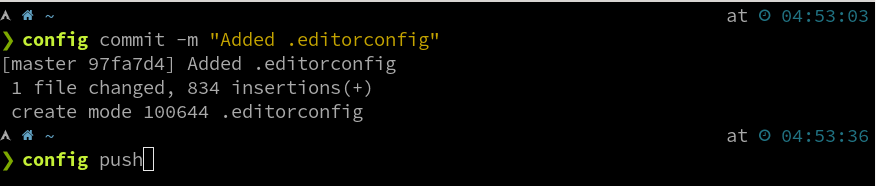
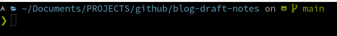

### Terminal Setup & Config Files

git branch + time and working directory path

### Terminal Emulator

- [Terminology](https://www.enlightenment.org/docs/apps/terminology.md)

### Unix Shell

- [Zsh](https://en.wikipedia.org/wiki/Z_shell)

### OS Environment

- [Arch Linux](https://archlinux.org)

### Reference

- [The best way to store your dotfiles: A bare Git repository](https://www.atlassian.com/git/tutorials/dotfiles)
- [Zsh Theme : Powerlevel10k](https://github.com/romkatv/powerlevel10k)
- [Inspiration](https://github.com/Powerlevel9k/powerlevel9k/wiki/Show-Off-Your-Config)

### TODO

- [ ] Add more file dotfiles[1](#add-more-dotfiles) in this repo.
- [ ] Add 

1  Add the following dotfiles [&#8617;](#fn1)

- .tmux.conf
- .vimrc
- ~~.zprofile~~
- .asciinema
- .gitconfig
- .todo.cfg
